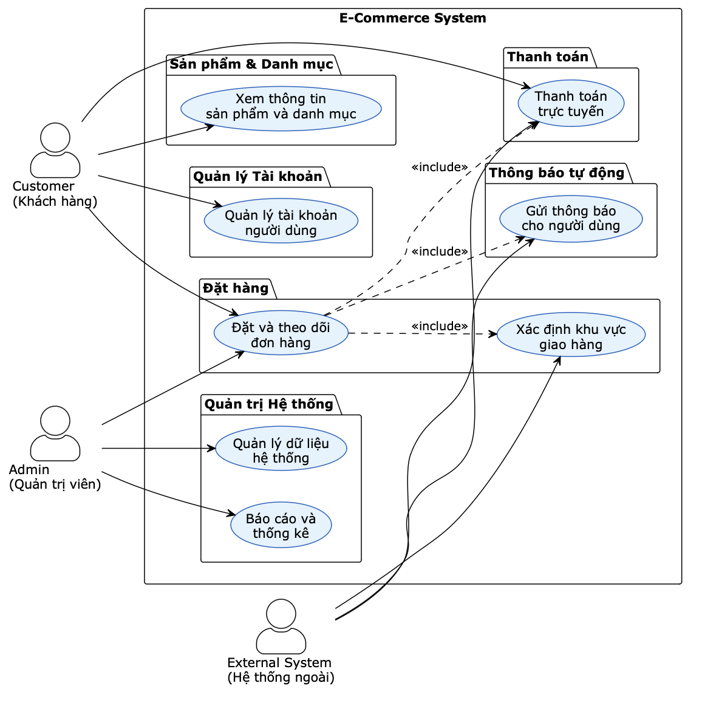
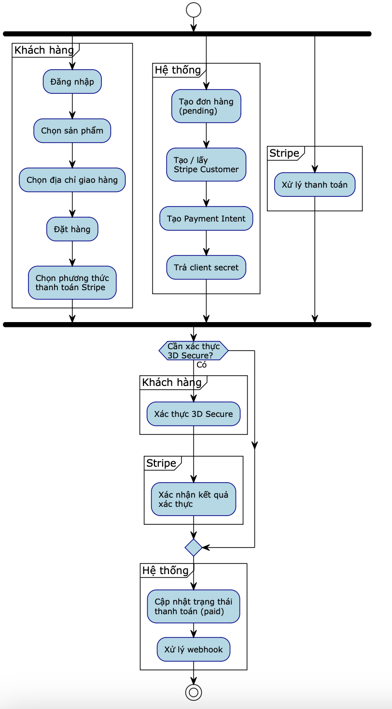
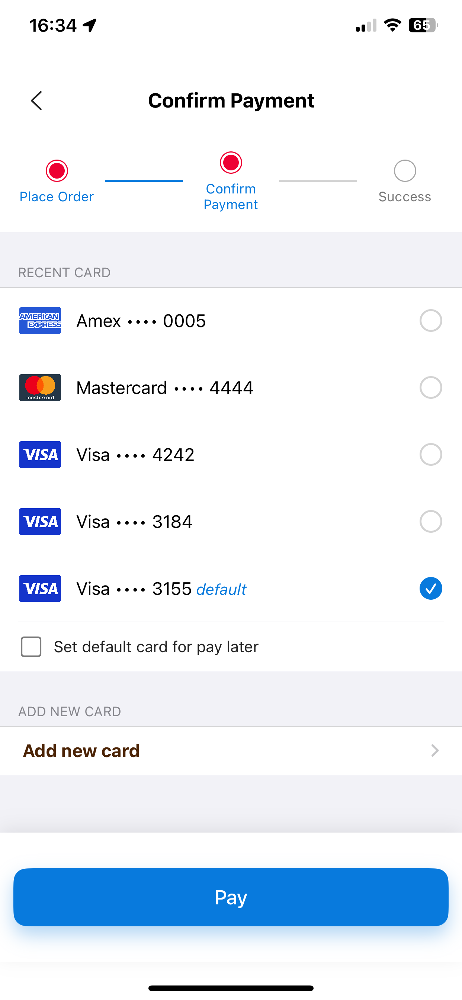
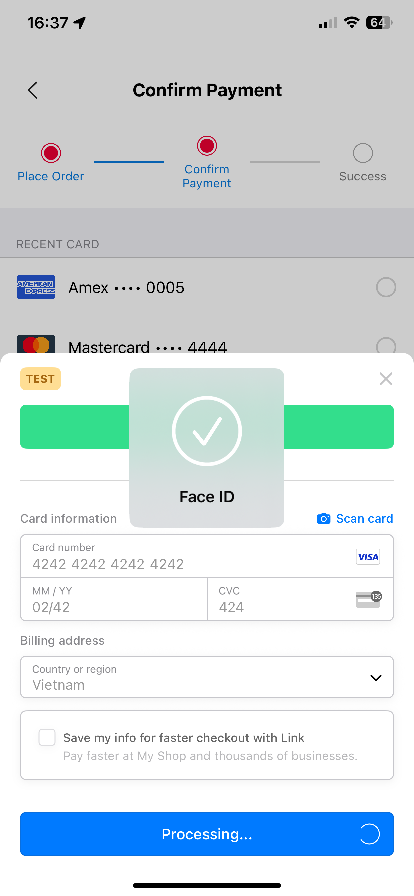
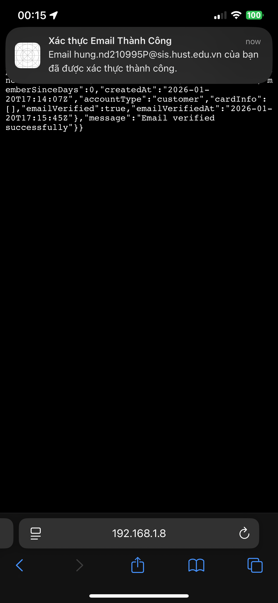

# ECommerce iOS App

Đồ án tốt nghiệp Cử nhân Đại học Bách Khoa Hà Nội với ứng dụng bán hàng có tích hợp cổng thanh toán Stripe với backend viết bằng Lavarel và iOS App với kiến trúc Clean Architecture (`Domain`, `Data`, `Presentation`).

## 1) Giới thiệu dự án

- Hỗ trợ các luồng chính: đăng nhập/đăng ký, tìm kiếm sản phẩm, giỏ hàng, đặt hàng, quản lý đơn hàng và thông báo.
- Tối ưu cho quy trình checkout thực tế: chọn phương thức thanh toán, xác thực người dùng và xác nhận đơn thành công và Push Notification
- Có các module bổ trợ như chọn địa chỉ trên bản đồ, xử lý ảnh và các thành phần UI tái sử dụng.

### Tổng quan use case

  

### Activity diagram đặt hàng

  

## 2) Công nghệ sử dụng

### Ngôn ngữ và nền tảng

- **Swift + UIKit**: xây dựng toàn bộ giao diện và luồng tương tác trên iOS.
- **Xcode / XCTest**: phát triển và kiểm thử ứng dụng.

### Kiến trúc và tổ chức mã nguồn

- **Clean architecture**: tách lớp `Domain`, `Data`, `Presentation`.
- **Dependency Injection (DIContainer)**: quản lý phụ thuộc theo từng scene.
- **Coordinator pattern**: điều phối luồng màn hình, giảm phụ thuộc trực tiếp giữa các View Controller.

### Networking và dữ liệu

- **URLSession-based networking**: `NetworkService`, xử lý timeout, status code và logging.
- **Repository + UseCase**: đóng gói nghiệp vụ, tách business logic khỏi UI.

### Thanh toán và bảo mật

- **Stripe SDK** (`Stripe`, `StripePaymentSheet`, `StripePayments`) cho luồng thanh toán thẻ.
- **LocalAuthentication** (`Face ID/Touch ID + passcode fallback`) để xác thực chủ sở hữu thiết bị trước khi thực hiện thanh toán.

  
  &nbsp;
  

  

### Bản đồ và định vị

- **MapKit + CoreLocation**: hiển thị bản đồ, tìm kiếm địa điểm và quản lý vị trí người dùng.

### Thông báo và tương tác người dùng

- **UserNotifications**: nhận Push Notification, xử lý khi app foreground/background/kill state và điều hướng theo loại thông báo.

  

## 3) Tech Skills

### iOS app architecture và clean code

- Thiết kế module theo trách nhiệm rõ ràng (Controller/UseCase/Repository).
- Dễ test và dễ thay thế implementation nhờ protocol-oriented design.
- Tái sử dụng UI component để giảm trùng lặp code, nhất quán về UI và trải nghiệm người dùng.

### Tích hợp SDK và xử lý nghiệp vụ thực tế

- Tích hợp Stripe cho thanh toán thực tế, bao gồm các luồng xác thực (3DS/biometric).
- Thiết kế flow thanh toán có kiểm soát lỗi và phản hồi rõ ràng cho người dùng.

### Bảo mật và xác thực người dùng

- Áp dụng xác thực sinh trắc học (Face ID/Touch ID) kết hợp passcode fallback.
- Quản lý token, session và một phần luồng bảo vệ truy cập trong app.

### Làm việc với API và backend

- Thiết kế lớp networking riêng để kiểm soát retry/timeout/error handling.
- Mapping dữ liệu và tách biệt tầng nghiệp vụ qua UseCase/Repository.

### Kiểm thử và xác minh luồng nghiệp vụ

- Có cấu trúc test iOS (`ECommerceTests`, `ECommerceUITests`).
- Kiểm thử các luồng tương tác thực tế (ví dụ xác minh mở link email).

  

---

## 4) Định hướng mở rộng

- Bổ sung test coverage cho các luồng thanh toán và quản lý đơn hàng.
- Chuẩn hóa logging/monitoring cho production.
- Mở rộng khả năng cá nhân hóa gợi ý sản phẩm dựa trên hành vi người dùng.
